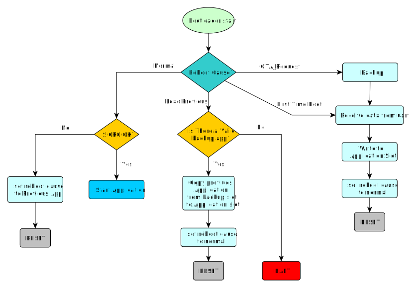

# STM32F429ZIT6 OTA Project

## To-Do:

- [x] Write Bootloader with OTA supported
- [x] Write A PC Tool for download Application Binary File
- [x] Write A Protocol between host and client for requesting and handling OTA state
- [ ] Write An Application For NodeMCU to Get and Store the Binary File From Internet
- [ ] Write An Application For NodeMCU to Upgrade STM32 IC

### Bootloader Flowchart


## Requirements:
### Hardware:
- STM32F429ZIT6 Discovery Board
- NodeMCU
- CH340G (or Any USB to TTL Module)

### Software:
- STM32CubeIDE V1.11.2
- Any Serial Communication Software Like PuTTY, Docklight, ...
- STM32CubeProgrammer (Optional)

## Usage:
- Clone this Repositpry.
- Set STM32CubeIDE Workspace to the repository directory.
- Fool Erase Flash.
- Download Bootloader via Programmer.
- Make and build Application. copy `Application.bin` file to PC Tool directory.
- Make and build PC Tool with this command (or download released tool):
  ```
  gcc main.c RS232\rs232.c -IRS232 -Wall -Wextra -o2 -o <app_name>
  ```
- in the first boot, board is on the DFU mode. run this command for download the file to MCU Flash:
  ```
  ./<app_name>.exe -c <COM_port> -f <Application_bin_file> -v <ver_major>.<ver_minor> -b
  ```
- After downloading proccess, You can make another bin file from Application project and download it whit this command:
  ```
  ./<app_name>.exe -c <COM_port> -f <Application_bin_file> -v <ver_major>.<ver_minor>
  ```
  (Use the `-b` argument when the device is in DFU mode.)

