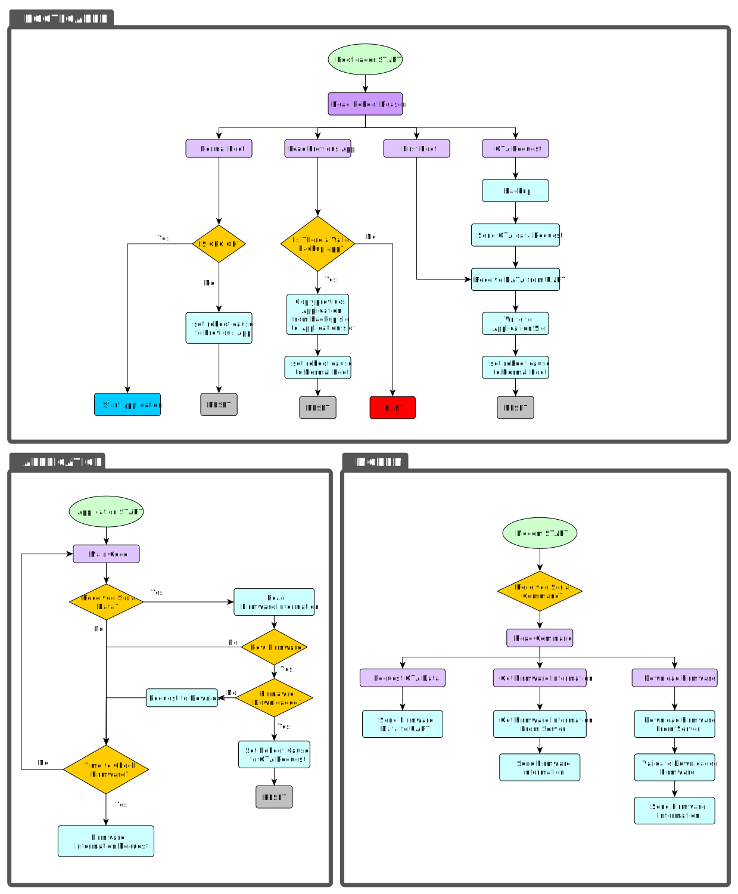

# STM32F429ZIT6 OTA Project

## To-Do:

- [x] Writing Bootloader with OTA supported
- [x] Writing A PC Tool for download Application Binary File
- [x] Writing A Protocol between host and client for requesting and handling OTA state
- [x] Writing An Application For NodeMCU to Get and Store the Binary File From Internet
- [x] Writing An Application For NodeMCU to Upgrade STM32 IC
- [ ] New Tasks will be updated ASAP...

### OTA Flowchart


## Requirements:
### Hardware:
- STM32F429ZIT6 Discovery Board
- NodeMCU
- CH340G (or Any USB to TTL Module)

### Software:
- STM32CubeIDE V1.11.2
- Any Serial Communication Software Like PuTTY, Docklight, ...
- STM32CubeProgrammer (Optional)

## Usage:
- Clone this Repositpry.
- Set STM32CubeIDE Workspace to the repository directory.
- Fool Erase Flash.
- Download Bootloader via Programmer.
### First Time Boot:
- Make and build Application. copy `Application.bin` file to PC Tool directory.
- Make and build PC Tool with this command (or download released tool):
  ```
  gcc main.c RS232\rs232.c -IRS232 -Wall -Wextra -o2 -o <app_name>
  ```
- in the first boot, the MCU is on the DFU mode. Run this command for download the file to the MCU Flash:
  ```
  ./<app_name>.exe -c <COM_port> -f <Application_bin_file> -v <ver_major>.<ver_minor> -b
  ```
### Firmware Update:

you can update firmware in two way: offline or Online programming. 

#### Ofline Updating:
- You can make another bin file from Application project and download it whit this command:
  ```
  ./<app_name>.exe -c <COM_port> -f <Application_bin_file> -v <ver_major>.<ver_minor>
  ```
  (Use the `-b` argument when the device is in DFU mode.)

- Note that you should insert a higher version number in arguments.

#### Online Updating:
- Upload WebTool in your Server/Host.
- Set your password in `index.php` file.
- Go to `https://<your_website>/index.php` and enter new firmware information and your password. then Submit the form.
- Note that you should enter a higher version number.
- you can check the last firmware information in `https://<your_website>/index.php?getinfo`.
- before programming NodeMCU, insert your WiFi SSID and PASSWORD and the address of Server/Host for getting information.
- Program NodeMCU (ESP-12E/F).
- Connect the Main Serial Port of NodeMCU to the STM32 UART with baudrate equals to 9600.
- STM32 Will Check the new firmware and download it automatically.

# Refferences
- [STM32 Refference Manual RM0090](https://www.st.com/resource/en/reference_manual/dm00031020-stm32f405-415-stm32f407-417-stm32f427-437-and-stm32f429-439-advanced-arm-based-32-bit-mcus-stmicroelectronics.pdf)
- [Embetronicx Bootloader](https://github.com/Embetronicx/STM32-Bootloader/blob/main/Bootloader_Example/HostApp/PcTool/etx_ota_update_main.c)
- [ChatGPT3.5](https://chat.openai.com)

